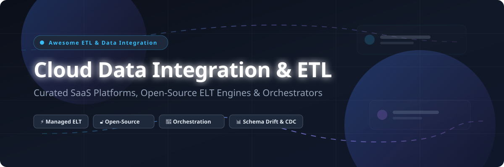

# 🚀 Awesome Cloud Data Integration & ETL

---

> ⚡ **Curated List of SaaS Platforms & Open-Source GitHub Projects**
> 
> *Focused on Data Pipelines, Cloud Data Integration, ETL/ELT, Connectors, Schema Drift Handling, Change Data Capture (CDC) & Pipeline Orchestration.*
>
> 📅 **Last updated: October 2026**

---

## 🔍 Overview & Ecosystem Focus

This repository tracks notable **SaaS platforms** and **open-source projects** for **Cloud Data Integration & ETL/ELT**. These enterprise-grade tools help data engineering teams move data seamlessly from relational databases, SaaS applications, and logs into modern cloud data warehouses (Snowflake, BigQuery, Databricks, Redshift) and data lakes, transform it into analytics-ready schemas, and orchestrate complex DAG workflows at scale.

- **Ingestion & Managed ELT**: Fivetran, Airbyte, Stitch, Hevo Data
- **Cloud Hyperscaler Native ETL**: AWS Glue, Azure Data Factory, Google Cloud Dataflow
- **Enterprise Data Platforms**: Informatica Cloud Data Integration, Talend Cloud (Qlik), Matillion
- **Open-Source Engines & Orchestrators**: Apache Airflow, Vector, Airbyte, Kestra, Prefect, Logstash, Mage AI, Dagster, dbt Core, Apache SeaTunnel, Apache Camel, Apache NiFi, Flink CDC, Meltano, Singer, Apache Hop

---

## 📖 Table of Contents

- [☁️ SaaS / Hosted Platforms](#-saas--hosted-platforms)
- [🔓 Open-Source GitHub Projects](#-open-source-github-projects)
- [🤝 How to Contribute](#-how-to-contribute)
- [⚠️ Disclaimer](#%EF%B8%8F-disclaimer)
- [💖 Support & Community](#-support--community)
- [⭐ Star History](#-star-history)

---

## ☁️ SaaS / Hosted Platforms

> **📊 Market Context**: The global data integration and ETL market is estimated at **~$14.8B in 2026**, growing toward **~$35B by 2031** at a **~18.7% CAGR**. The sector is **moderately fragmented** rather than a winner-take-all market — hyperscalers (AWS, Microsoft, Google) dominate cloud-native data lake infrastructure, while specialized platforms (Fivetran, Matillion, Informatica, Airbyte) lead in managed connectors, automated schema drift handling, and enterprise data warehouse replication.

*Sorted by **Company Size (Revenue / Valuation)** in descending order.*

| Platform | Description | Pricing (Starting Tier) | Free Tier Limits | Company Size 🏢 |
| :--- | :--- | :--- | :--- | :--- |
| **[AWS Glue](https://aws.amazon.com/glue/)** | Serverless visual and code-based ETL service on AWS. Native integration with S3, Redshift, Iceberg, and AWS ecosystem. | **$0.44 per DPU-hour** (Data Processing Unit, billed per second with 1-min minimum). Catalog requests: $1.00 per 1M requests above free tier. | **AWS Free Tier**: **1,000,000 Data Catalog objects** and **1,000,000 Data Catalog requests/month** free forever (ETL jobs require paid DPU usage or AWS $300 trial credits). | **~$638B revenue (Amazon FY2025)** |
| **[Google Cloud Dataflow](https://cloud.google.com/products/dataflow)** | Google's serverless service for Apache Beam pipelines. Unified batch and streaming data processing. | **Batch**: $0.056 per vCPU-hour & $0.003567 per GB-hour; **Streaming**: $0.069 per vCPU-hour & $0.003567 per GB-hour (US regions). | **$300 free trial credits** valid for 90 days across Google Cloud (no perpetual free tier for Dataflow execution). | **~$350B revenue (Alphabet FY2025)** |
| **[Azure Data Factory](https://azure.microsoft.com/en-us/products/data-factory/)** | Microsoft's hybrid cloud data integration service. 100+ native connectors, mapping data flows, and SSIS package execution. | **Data Pipeline Orchestration**: ~$0.005/hour per activity run; **Data Flows**: ~$0.276/hour per vCore-hour; **Integration Runtime**: From ~$0.10/hour. | **1,000 activity runs/month free** for 12 months with Azure free account + **$200 credit for 30 days**. | **~$281B revenue (Microsoft FY2025)** |
| **[Fivetran](https://www.fivetran.com/)** | Fully managed automated ELT platform with 700+ connectors. Zero-maintenance automated schema drift handling and CDC replication. | **$5/month minimum per connection** (MAR consumption starting at ~$1 per 10k MAR; Starter tier from $5/mo, Standard $10/mo, Enterprise $15/mo). Annual commits discount spend rates 5–36%. | **Free forever plan**: 500,000 MAR/month with unlimited connections + **14-day free trial** with unlimited usage and 14-day free period per new connection. | **$5.87B valuation, $600M ARR, $985M raised** |
| **[Informatica Cloud Data Integration](https://www.informatica.com/)** | Enterprise iPaaS & IDMC platform for cloud and hybrid deployments. Broad connectivity including SAP, Oracle, and Mainframe systems. | **CDI-PayGo**: ~$1.00 per IPU (Informatica Processing Unit); enterprise subscription tiers start at **~$10,000–$25,000/year** based on consumption. | **CDI-Free plan**: **20 million rows/month** (ELT) or **10 processing hours/month** (ETL) free forever + **30-day free trial** for full platform. | **~$1.6B revenue, private (taken private by Permira, 2024)** |
| **[Matillion](https://www.matillion.com/)** | Enterprise ELT platform with cloud-native transformation. Native dbt integration, visual no-code and high-code Python/SQL options. | **Basic: $2.00/credit** (starts at **$1,000/month** minimum for 500 credits); **Advanced: $2.50/credit** (**$2,000/month**). | **14-day free trial** with 500 free credits (no perpetual free tier for paid cloud editions). | **$1.5B valuation, $99M revenue, $365.7M raised** |
| **[Airbyte Cloud](https://airbyte.com/)** | Fully managed cloud ELT service powered by Airbyte open-source engine. 300+ pre-built connectors and custom connector builder. | **Standard: $20/month minimum** ($2.50 per credit, includes 5 credits); **Plus: $189/month** (40 credits); extra credits **$5 each**. | **14-day free trial** with **$400 in free credits** (self-hosted Community Edition is free forever). | **$1.5B valuation, $181M raised (private)** |
| **[Hevo Data](https://hevodata.com/)** | Fully managed ELT platform with 150+ connectors. Near real-time replication with automated pipeline schema management. | **Starter: $239/month** ($299/mo billed monthly for 5M events); **Professional: $549/month**; **Business Critical: Custom**. | **Free forever plan**: Up to **1 million events/month** for 50+ free connectors (5 pipelines, 5 users) + **14-day free trial** with 24x7 support. | **$281.6M valuation, $46.9M revenue, $43M raised** |
| **[Stitch](https://www.stitchdata.com/)** | Cloud-first developer-focused ETL platform (owned by Talend/Qlik). Rapid data replication from SaaS tools to data warehouses. | **Standard: $100/month** for 10M rows; **Advanced: $1,500/month** (annual) for 100M rows; **Premium: $3,000/month** (annual) for 1B rows. | **Free forever plan**: Up to **5 integrations** and **5 million total rows/month** + **14-day free trial** of Standard plan. | **Part of Qlik/Talend ($140M revenue)** |
| **[Talend Cloud](https://www.talend.com/)** | Enterprise data integration, data governance, and data quality platform. Now integrated into Qlik ecosystem. | **Starter / Team tier**: Starts at **~$1,000/month** ($12,000/year); Enterprise editions range **$50,000–$200,000+/year** based on volume/duration. | **14-day free trial** (no perpetual free tier; open-source Talend Open Studio retired Jan 2024). | **$140M revenue, part of Qlik** |

---

## 🔓 Open-Source GitHub Projects

*Sorted by **GitHub Star Count** in descending order. Click on any star badge to inspect stargazers!*

| Repo | Description | Stars 🌟 |
| :--- | :--- | :--- |
| **[Apache Airflow](https://github.com/apache/airflow)** | The de facto standard for programmatic workflow orchestration. Python DAGs, rich web UI, extensive provider ecosystem. Apache-2.0. |  |
| **[Vector](https://github.com/vectordotdev/vector)** | High-performance, ultra-fast observability data pipeline and log ingestion engine written in Rust. Apache-2.0. |  |
| **[Airbyte](https://github.com/airbytehq/airbyte)** | Leading open-source ELT platform with **300+ connectors**. Full data replication, normalization, and CDC support. AGPL-3.0 / Elastic. |  |
| **[Kestra](https://github.com/kestra-io/kestra)** | Declarative orchestration platform for data, AI, and infrastructure. Language-agnostic, YAML-based, event-driven pipelines. Apache-2.0. |  |
| **[Prefect](https://github.com/PrefectHQ/prefect)** | Modern workflow orchestration framework. Python-native, dynamic execution graphs, hybrid cloud architecture. Apache-2.0. |  |
| **[Logstash](https://github.com/elastic/logstash)** | Server-side data processing pipeline that ingests data from a multitude of sources simultaneously, transforms it, and sends it to your favorite stash. Apache-2.0. |  |
| **[Mage AI](https://github.com/mage-ai/mage-ai)** | Open-source data pipeline tool for transforming and integrating data. Hybrid notebook UI + pipeline editor. Apache-2.0. |  |
| **[Dagster](https://github.com/dagster-io/dagster)** | Cloud-native data orchestrator designed for machine learning, analytics, and ETL. Data asset-centric programming model. Apache-2.0. |  |
| **[dbt Core](https://github.com/dbt-labs/dbt-core)** | The industry standard for SQL-based transformation in the warehouse. Version-controlled SQL, testing, documentation, and lineage. Apache-2.0. |  |
| **[Apache SeaTunnel](https://github.com/apache/seatunnel)** | Very high-performance distributed data integration platform for massive batch and real-time data sync. 100+ connectors. Apache-2.0. |  |
| **[Apache Camel](https://github.com/apache/camel)** | Powerful open-source integration framework based on Enterprise Integration Patterns (EIP). 300+ components. Apache-2.0. |  |
| **[Apache NiFi](https://github.com/apache/nifi)** | Visual data flow orchestration platform with drag-and-drop web UI. Optimized for enterprise data streaming and IoT pipelines. Apache-2.0. |  |
| **[Flink CDC](https://github.com/apache/flink-cdc)** | Real-time streaming data integration with change data capture (CDC) and exactly-once semantics. Supports MySQL, Postgres, Oracle. Apache-2.0. |  |
| **[Meltano](https://github.com/meltano/meltano)** | Code-first data integration engine built on Singer specification. Declarative YAML pipelines, CLI-driven, Git-friendly architecture. MIT. |  |
| **[Singer Specification](https://github.com/singer-io/getting-started)** | Open-source standard for writing data extraction Taps and loading Targets to move data between any source and destination. Apache-2.0. |  |
| **[Apache Hop](https://github.com/apache/hop)** | Visual data engineering and orchestration platform. Metadata-driven pipeline execution, Spark/Flink support, visual designer. Apache-2.0. |  |

---

## 🤝 How to Contribute

Contributions are warmly welcomed! Help keep this curated list up to date and accurate:

1. **Fork** this repository.
2. Add or update entries in `README.md` following the exact table structure.
3. Ensure all links point to official domain pages and repo links point to GitHub stargazers pages where applicable.
4. Keep descriptions factual, concise, and non-promotional.
5. Submit a **Pull Request** with a brief summary of additions or pricing updates.

Check out our curated meta-list at **[Awesome-Awesome-Awesome](https://github.com/ishandutta2007/Awesome-Awesome-Awesome)** for more curated awesome lists!

---

## ⚠️ Disclaimer

- This list is **community-curated** for educational, evaluation, and research purposes.
- Enterprise pricing and free tier limits are subject to vendor updates. Always consult official vendor sales channels for binding contract quotes.
- Data integration platforms handle sensitive organizational telemetry; ensure security compliance with HIPAA, GDPR, and SOC2 regulations before deployment.

---

## 💖 Support & Community

If you find this repository valuable for your data engineering platform decisions or pipeline architecture:

- ⭐ **Star** this repository to help others discover it!
- 🔀 **Fork** and contribute new tools or connector improvements.
- 📢 **Share** with your data team, platform engineers, and analytics community!

---

## ⭐ Star History

---

**Crafted with ❤️ for Data Engineers, Analytics Engineers, Platform Teams &amp; Data Architects.**

